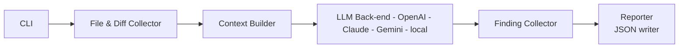

# AI Code-Review Assistant  
*Implementation Design Document — v1.0 (May 2025)*  

---

## Table of Contents
1.  Overview  
2.  System Goals & Non-Goals  
3.  High-Level Architecture  
4.  Execution Flow  
5.  Package / Module Specification  
6.  Configuration Files  
7.  Data Models & Schemas  
8.  LLM Integration Details  
9.  CLI Specification & Usage Examples  
10.  Error-Handling & Time-outs  
11.  Packaging, Installation & Runtime Requirements  
12.  Logging, Metrics & Cost Reporting  
13.  Extensibility Road-map  
14.  Open-Source & Licensing Notes  

---

## 1  Overview
The **AI Code-Review Assistant** is a Python-based command-line tool that scans any codebase (any language) and produces a structured JSON report of rule violations, augmented with Large-Language-Model (LLM) reasoning where deterministic matching is insufficient.

*Version 1* emphasises **breadth** (works on "any text file") over language-specific depth; it therefore avoids heavy grammar parsers such as *tree-sitter* and relies on:

*  textual diff parsing, and
*  LLM prompts for semantic analysis.

Future versions can plug in richer language parsers without altering the public API.

---

## 2  System Goals & Non-Goals
| Aspect | Goal | Non-Goal |
|--------|------|----------|
| **Language support** | Accept any source file as plain text. | Perfect AST-aware analysis in v1. |
| **Security / privacy** | Keep credentials out of VCS; user controls keys. | Advanced in-prompt redaction (future). |
| **Automation depth** | Flag issues (`info / warning / error`). | Auto-fix / code‐transform patches. |
| **Deployment** | Local CLI, no network services required (except LLM calls). | CI pipelines, GitHub Checks in v1. |
| **Output** | Single JSON artefact with findings + cost. | SARIF / Markdown (future add-on). |

---

## 3  High-Level Architecture



1.  **Collector**  builds the work-set: changed lines, single files, directories or whole repo.
    
2.  **Context Builder** structures the input as JSON with:
    - Full file content
    - Structured change metadata (line numbers, change types)
    - File metadata (path, language)
    - Related context (commit messages, affected files)
    
3.  **LLM Back-end** performs semantic analysis with structured context.
    
4.  **Reporter**  consolidates everything into  `findings.json`, including token usage and cost.

### Context Structure Example
For diff review (target and source branches in git)
```json
{
  "file": "src/main.py",
  "language": "python",
  "changes": {
    "type": "diff",
    "hunks": [
      {
        "start_line": 45,
        "end_line": 46,
        "before": "def old_function():\n    return None",
        "after": "def new_function():\n    return True"
      }
    ]
  },
  "full_content": "... entire file content ..."
}
```

For single file review (file command)
```json
{
  "file": "src/main.py",
  "language": "python",
  "review_type": "file",
  "full_content": "def process_data():\n    data = fetch_data()\n    return transform(data)\n\ndef transform(data):\n    return data.upper()"
}
```

For directory review (dir command). One request per file
```json
{
  "file": "src/main.py",
  "language": "python",
  "review_type": "directory",
  "full_content": "def process_data():\n    data = fetch_data()\n    return transform(data)"
}
```

----------

## 4 Execution Flow

1. **Start-up**  – CLI parses flags, loads  `.env`, YAML rule mapping, and user RuleSets.
    
2. **Target resolution**
   - `diff <target>..<source>` - list of modified files & line spans.
   - `file` - single file review
   - `dir` - enumerate files recursively within provided path (globs honoured). 
        
3. **Context Building**  – For each changed file:
   - Collect full file content
      - **If `diff`** Build structured diff with before/after changes
   - Prepare context for LLM analysis
    
4. **LLM Analysis**  – Process files in batches with full context (≤ 15 s request timeout).
    
5. **Finding merge**  – Duplicate suppression, severity assignment (`info|warning|error`).
    
6. **Report write**  –  `findings.json`  saved to  `--out`  (default  `./code_review_findings.json`).
    
7. **Exit**  – Always  `exit 0`  in v1 (no CI semantics).

----------

## 5 Package / Module Specification

| Package | Core Classes / Functions | Notes |
|--------|------|----------|
| `codereview.cli` | `app`  (Typer instance), sub-commands (`diff`,  `file`,  `dir`) | Thin layer; no business logic. |
| `codereview.collector` | `GitDiff`,  `DirectoryScanner`,  `FileLoader` | Uses  _GitPython_  or subprocess for diffs. |
| `codereview.rules` | `Rule`, `RuleSet`, `RuleSetMapper` | Manages rules, rule sets, and their path mappings. |
| `codereview.llm` | `BaseBackend`,  `OpenAIBackend`,  `ClaudeBackend`,  `GeminiBackend`,  `LocalBackend`,  `BackendFactory` | Uniform async  `.review(prompt)->FindingsJSON`. |
| `codereview.prompt` | `PromptBuilder` | Formats system & user messages |
| `codereview.findings` | `Finding`,  `FindingCollector`, de-dup helpers | Frozen dataclass for immutability. |
| `codereview.report` | `JSONWriter` | Emits final artefact & prints summary (model used, time taken, cost to run). |
| `codereview.config` | `EnvLoader`,  `UserConfig` | Reads  `.env`, merges CLI overrides, holds time-out. |

----------


## 6 Configuration Files

### 6.1  `.env`

```ini
`OPENAI_API_KEY=... 
ANTHROPIC_API_KEY=... 
GOOGLE_API_KEY=... 
LLAMA_SERVER_URL=http://localhost:11434` 
```
_Ignored by Git._  Users manage their own secrets.

### 6.2  Configuration Structure

`codereview.yaml`
```yaml
# Repository root configuration
version: "1.0"

# File collection patterns
include:
  - "*.py"
  - "*.js"
  - "*.ts"
  - "*.swift"
exclude:
  - "tests/*"
  - "node_modules/*"
  - "*.test.*"
  - "build/*"
  - "dist/*"

# LLM configuration
llm:
  provider: "openai"  # openai, anthropic, google, local
  model: "gpt-4o"     # provider-specific model
  timeout_sec: 15     # per request timeout

# Rules configuration
rules:
  path: "rules/"      # relative to repository root
  mapping: "rules/ruleset_mapping.json"

# Output configuration
output:
  file: "code_review_findings.json"
  format: "json"      # future: sarif, markdown
```

### 6.3 Rule Definition Example
```markdown
rules/
├─ rules/
│   ├─ security/
│   │   └─ secrets.json
│   └─ style/
│       └─ pep8.json
├─ rulesets/
│   ├─ style_guide.json
│   └─ security.json
└─ ruleset_mapping.json
```

```json
{
  "id": "SEC-001",
  "name": "No Hardcoded Secrets",
  "description": "Check for potential secrets, API keys, or credentials in code",
  "severity": "error",
  "examples": {
    "bad": ["API_KEY = 'sk_live_123'"],
    "good": ["API_KEY = os.getenv('API_KEY')"]
  }
}
```

### 6.4 RuleSet Definition Example
```json
{
  "id": "STYLE-001",
  "name": "Python Style Guide",
  "description": "Enforces PEP 8 and project-specific style guidelines",
  "rules": [
    "SEC-001",
    "STYLE-001",
    "STYLE-002"
  ]
}
```

### 6.5 RuleSet Mapping Example
```json
{
  "mappings": [
    {
      "path": "src/**",
      "rule_sets": ["STYLE-001", "SEC-001"]
    },
    {
      "path": "tests/**",
      "rule_sets": ["TEST-001"]
    }
  ]
}
```

The rules system consists of three main components:
1. **Rules**: Individual guidelines with examples of good and bad practices
2. **RuleSets**: Groups of related rules with a common goal (e.g., style, security)
3. **RuleSet Mapping**: Configuration that maps paths to applicable RuleSets

This structure allows for:
- Clear separation of concerns
- Reusable rule sets across different paths
- Easy addition of new rules and rule sets
- Flexible path-based rule application
- JSON are faster to parse than other formats

----------

## 7 Output Data Models & Schemas

```python
`# findings.py  
@dataclass(frozen=True) 
class  Finding:
    file: str  # relative path 
    line: int  # 1-based 
    rule_id: str 
    message: str 
    severity: Literal["info", "warning", "error"] 

@dataclass
class CostSummary:
    provider: str 
    model: str 
    tokens_prompt: int 
    tokens_completion: int 
    cost_usd: float
    processing_time: float  # seconds

@dataclass
class ProcessingMetrics:
    files_processed: int
    total_time: float
    avg_time_per_file: float
    collection_time: float
    context_build_time: float
    llm_analysis_time: float`
``` 

### Output File (`findings.json`)

```jsonc
{
  "version": "1.0",
  "metadata": {
    "timestamp": "2025-05-08T10:15:32Z",
    "mode": "diff",
    "base_ref": "main",
    "head_ref": "feature/xyz",
    "metrics": {
      "files_processed": 12,
      "total_time": 45.2,
      "avg_time_per_file": 3.8,
      "collection_time": 0.5,
      "context_build_time": 2.1,
      "llm_analysis_time": 42.6
    },
    "llm": {
      "provider": "openai",
      "model": "gpt-4o",
      "timeout_sec": 15,
      "total_cost_usd": 0.0134,
      "processing_time": 15.2
    }
  },
  "findings": [
    {
      "file": "Sources/App/Networking/API.swift",
      "line": 88,
      "rule_id": "GEN-001",
      "severity": "warning",
      "message": "Debug prints should not be committed."
    }
  ]
}
```
----------

## 8 LLM Integration Details

-   **Back-ends shipped**:
    
    -   `openai:gpt-4o`  _(default)_
        
    -   `anthropic:claude-3-haiku`
        
    -   `google:gemini-1.5-pro-latest`
        
    -   `local:llama.cpp`  (HTTP server)
        
-   **Timeout**: 15 s per request (`asyncio.wait_for`).
    
-   **Cost tracking**:
    
    -   Each backend returns  `(prompt_tokens, completion_tokens, cost_usd)`.
        
    -   Aggregated in  `CostSummary`.
        
    -   Printed in CLI footer and saved in report.
        
-   **Prompt format (simplified)**:
    
    ```sql
    
    `system: You are an expert code reviewer. 
    user: 
      <RULES>  
      <CODE_SNIPPET> List any violations in JSON array  with keys:
        file, line, rule_id, message, severity` 
    ```
    
-   **Retries**: Exponential back-off, max 3 attempts on network errors.
    

----------

## 9 CLI Specification

| Command | Example | Meaning |
|--------|------|----------|
| `diff` | `codereview diff main..source` | Review only changed lines. |
| `file` | `codereview file path/to/file.py` | Single file. |
| `dir` | `codereview dir Sources/` | All files recursively. |

### CLI Flags

| Flag | Description |
|--------|------|
| `--verbose` | Enable debug logging |

----------

## 10 Error-Handling & Time-outs

-   **Collector errors**  (bad Git ref, unreadable file): log and continue.
    
-   **Rule YAML parse error**: abort execution with clear message.
    
-   **LLM timeout**: mark affected snippet with  `"severity": "info", "message": "LLM timeout"`  (abort).
    
-   **Unhandled**  exceptions bubble to CLI, shown with stack-trace (debug).
    

----------

## 11 Packaging & Runtime

-   **Python ≥ 3.12**  enforced by  `pyproject.toml`.
    
-   **Poetry**  for builds;  `poetry install --with cli`.
    
-   **Entry-point**:  `codereview = codereview.cli:app`.
    
-   Distribution under  **MIT license**.

----------

## 12 Logging, Metrics & Cost Reporting

-   Uses  **`rich`**  for coloured console logs.
    
-   Levels:  `INFO`  default,  `DEBUG`  via  `--verbose`.
    
-   Metrics summary printed like:
    
```bash
── Review Summary ─────────────────────────────
Files processed: 12
Total time: 45.2s
Average time per file: 3.8s

── LLM Metrics ─────────────────────────────
provider/model        $USD    tokens    time
openai/gpt-4o        0.0134   2 112    15.2s
anthropic/claude     0.0089   1 845    12.4s

── File Processing ──────────────────────────
File collection: 0.5s
Context building: 2.1s
LLM analysis: 42.6s
``` 

All metrics are also saved in the output JSON for programmatic access.

----------

## 13 Extensibility Road-map

| Phase | Feature |
|--------|------|
| **v2.0** | Optional  _tree-sitter_  language packs for deep static rules. |
| **v2.1** | GitHub / GitLab PR Check integration; annotate diffs. |
| **v3.0** | IDE extensions (VS Code, Xcode source extensions). |
| **v3.1** | Auto-fix suggestions & refactorings (patch hunks). |

----------

## 14 Open-Source & Licensing Notes

 - Core project released under  **MIT**.
    
 - Must vet third-party deps—`gitpython`,  `typer`,  `rich`,  `openai`,  `anthropic`,  `google-generativeai`—to ensure permissive licenses (Apache 2.0 or MIT).
    
 - Users are responsible for accepting respective LLM provider ToS when adding their API keys.